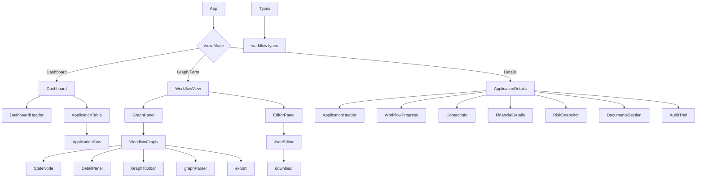

# Code Review: Loan Workflow UI

## Executive Summary

This is a well-structured React application for visualizing and managing loan workflow processes. The application has a clear separation of concerns with distinct components for graph visualization, form rendering, and application management. However, there are several areas for improvement in terms of code quality, architecture, and maintainability.

## Overall Architecture Assessment

The application follows a modular architecture with clear separation of concerns:
- `components/` - UI components organized by feature
- `types/` - TypeScript interfaces and types
- `utils/` - Utility functions for parsing, exporting, and other operations
- `data/` - Sample data files

The application implements three main views:
1. Dashboard - Application queue management
2. Workflow Graph - Visual representation of workflow processes
3. Form Viewer - Dynamic form rendering based on workflow states

## Identified Issues

### 1. Type Safety Issues

#### Inconsistent Field Action Handling
In `DetailPanel.tsx`, there's complex logic to handle both legacy `Actions` and new `FieldActions` fields, but the typing doesn't reflect this properly:

```typescript
// In DetailPanel.tsx
let actions: string[] = []
if (Array.isArray(f.Actions))
  actions = (f.Actions as unknown[]).map((a) => safeString(a)).filter(Boolean);
else if (Array.isArray(f.FieldActions)) {
  actions = (f.FieldActions as unknown[])
    .map((a) => {
      const aRec = a as Record<string, unknown>;
      return safeString(aRec.Operation);
    })
    .filter(Boolean);
}
```

This suggests the `Field` interface in `workflow.types.ts` should be updated to properly support both action types.

#### Weak Type Definitions
The `Field` interface in `workflow.types.ts` has an optional `FieldActions` property but also includes a legacy `Actions` property that's not well typed:

```typescript
export interface Field {
  ID: string;
  Name: string;
  Type: string;
  DataSource: string;
  FieldActions?: FieldAction[];
  Actions?: string[]; // Legacy support
}
```

#### Missing Type Validation
There's no comprehensive validation of the workflow JSON structure, which could lead to runtime errors if the JSON doesn't match the expected format.

### 2. Code Duplication and Inconsistencies

#### Duplicate Action Handling Logic
The logic for extracting and displaying field actions is duplicated between:
- `DetailPanel.tsx` (complex, handles both legacy and new formats)
- `StateNode.tsx` (simple, only handles new format)

This inconsistency could lead to different displays of the same data in different parts of the UI.

#### Inconsistent Field Rendering
In `FormViewer.tsx`, the field rendering logic doesn't handle all field types that are defined in the documentation (e.g., date, checkbox). The select field has hardcoded options rather than dynamically generating them from the field configuration.

#### Hardcoded Values
Several components have hardcoded values that should be configurable:
- `FieldInput.tsx` has hardcoded select options
- `FinancialDetails.tsx` has a hardcoded income multiplier
- `ContactInfo.tsx` has hardcoded contact information

### 3. Performance Issues

#### Unnecessary Re-renders
In `WorkflowGraph.tsx`, the `useEffect` hook that updates nodes and edges doesn't have proper dependency management:

```typescript
React.useEffect(() => {
  setNodes(initialNodes);
  setEdges(initialEdges);
}, [initialNodes, initialEdges, setNodes, setEdges]);
```

This could cause unnecessary re-renders when the setter functions change but the actual data doesn't.

#### Expensive Operations in Render
In `DetailPanel.tsx`, there's complex data transformation happening directly in the render method which could impact performance with large datasets.

#### Node Positioning Algorithm
In `graphParser.ts`, the node positioning uses a simple grid algorithm that doesn't scale well with complex workflows:

```typescript
position: {
  x: 250 * (index % 3),
  y: 200 * Math.floor(index / 3),
},
```

This could result in overlapping nodes for workflows with many states.

### 4. State Management Issues

#### Complex State Derivation
In `App.tsx`, the current state is derived from an index in an array of state keys:

```typescript
const stateKeys = Object.keys(workflow.Workflow?.States || {});
const [currentStateIndex, setCurrentStateIndex] = useState<number>(0);
const currentState = stateKeys[currentStateIndex] || stateKeys[0] || "";
```

This approach is fragile and could break if the order of states changes or if states are added/removed.

#### Global State Management
The application lacks a proper state management solution for complex state that could be shared across components.

### 5. UI/UX Issues

#### Limited Error Handling
The JSON editor has basic validation but doesn't provide detailed error messages about what's wrong with the JSON or where the errors are located.

#### Accessibility Concerns
Several components lack proper accessibility attributes:
- Missing ARIA labels
- Insufficient color contrast in some cases
- Keyboard navigation issues

#### Responsive Design
The application doesn't appear to be optimized for different screen sizes, which could be an issue for users on mobile devices or smaller screens.

### 6. Architecture Issues

#### Tight Coupling
Components like `DetailPanel.tsx` have intimate knowledge of the internal structure of data objects, making it difficult to change the data structure without updating multiple components.

#### Missing Abstraction
There's no clear abstraction layer for data fetching or business logic, which makes the components tightly coupled to specific data structures.

#### Inconsistent Component Patterns
Some components use inline styles while others might use CSS classes, leading to inconsistency in styling approaches.

## Security Considerations

### Potential XSS Vulnerabilities
The application uses `dangerouslySetInnerHTML` in some places (though not visible in the current files), which could introduce XSS vulnerabilities if not properly sanitized.

### Data Binding Security
The template syntax `{{ data.field }}` is used for data binding, but there's no apparent sanitization of the data before rendering.

## Proposed Improvements

### 1. Enhanced Type Safety
- Create a unified type for field actions that properly supports both legacy and new formats
- Use discriminated unions or other TypeScript features to make the type system more robust
- Add proper validation for workflow JSON structure
- Implement runtime type checking for critical data structures

### 2. Improved State Management
- Use a proper state management solution (e.g., Redux, Zustand) for complex state
- Implement proper selectors for derived data to avoid recomputation
- Use React's `useMemo` and `useCallback` more effectively
- Consider using React Context for theme and other global state

### 3. Better Component Architecture
- Create reusable hooks for common logic (e.g., field action processing)
- Implement a more flexible layout algorithm for graph nodes
- Create a proper form field abstraction that can handle all supported field types
- Standardize component patterns and styling approaches

### 4. Performance Optimizations
- Implement virtualization for large lists
- Use React's `memo` for components that render large datasets
- Optimize the graph rendering with proper React Flow practices
- Implement proper memoization strategies

### 5. Enhanced Error Handling
- Provide detailed error messages for JSON validation
- Implement proper error boundaries
- Add user-friendly error messages for common issues
- Implement logging for debugging purposes

### 6. Accessibility Improvements
- Add proper ARIA attributes to interactive elements
- Ensure sufficient color contrast for all text
- Implement keyboard navigation support
- Add screen reader support where appropriate

### 7. Security Enhancements
- Implement proper input sanitization
- Add Content Security Policy (CSP) headers
- Implement proper authentication and authorization checks
- Add rate limiting for API calls

## Testing Recommendations

### Unit Testing
- Add comprehensive unit tests for utility functions
- Test type validation functions
- Test component rendering with different data inputs

### Integration Testing
- Test the workflow from JSON parsing to graph rendering
- Test form rendering with different field configurations
- Test state transitions in the workflow

### End-to-End Testing
- Test the complete user journey from dashboard to form submission
- Test error scenarios and edge cases
- Test different screen sizes and devices

## Proposed Structure



## Detailed Recommendations

### 1. Type System Improvements
```typescript
// Instead of the current Field interface, consider:
interface BaseField {
  ID: string;
  Name: string;
  Type: FieldType;
  DataSource: string;
}

type FieldType = 'text' | 'number' | 'select' | 'textarea' | 'file' | 'date' | 'checkbox';

interface FieldWithActions extends BaseField {
  FieldActions: FieldAction[];
}

interface FieldWithLegacyActions extends BaseField {
  Actions: string[];
}

type Field = FieldWithActions | FieldWithLegacyActions;
```

### 2. Component Structure Refactoring
- Extract common logic into custom hooks
- Create a proper form field component abstraction
- Implement a more robust graph layout algorithm

### 3. State Management
- Consider implementing a global state management solution
- Create selectors for derived data
- Implement proper caching mechanisms

### 4. Performance Enhancements
- Virtualize large lists in the dashboard
- Optimize graph rendering with proper React Flow practices
- Implement proper memoization strategies

## Conclusion

The Loan Workflow UI application demonstrates a solid understanding of React principles and has a well-organized codebase. The core functionality is implemented effectively, and the application provides a good user experience for visualizing and managing loan workflows.

However, there are several areas where the application could be improved to enhance maintainability, performance, and developer experience. Addressing the type safety issues, implementing proper state management, and optimizing performance would significantly improve the quality of the codebase.

The application would benefit from:
1. More comprehensive testing
2. Better documentation of the component APIs
3. Implementation of accessibility features
4. Enhanced security measures
5. Improved error handling and user feedback

With these improvements, the application would be more robust, maintainable, and scalable for future development.