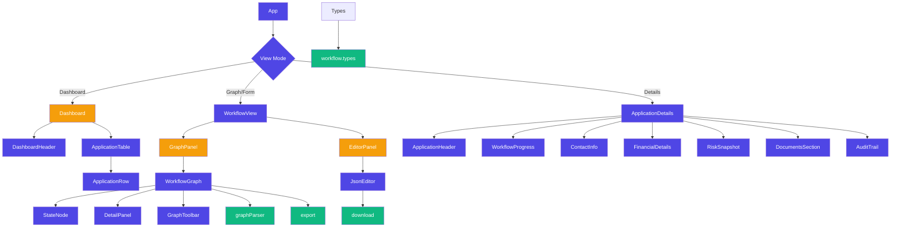

```mermaid
graph TD
    A[App] --> B{View Mode}
    B -->|Dashboard| C[Dashboard]
    B -->|Graph/Form| D[WorkflowView]
    B -->|Details| E[ApplicationDetails]
    
    C --> C1[DashboardHeader]
    C --> C2[ApplicationTable]
    C2 --> C3[ApplicationRow]
    
    D --> D1[GraphPanel]
    D --> D2[EditorPanel]
    
    D1 --> D1A[WorkflowGraph]
    D1A --> D1B[StateNode]
    D1A --> D1C[DetailPanel]
    D1A --> D1D[GraphToolbar]
    
    D2 --> D2A[JsonEditor]
    
    E --> E1[ApplicationHeader]
    E --> E2[WorkflowProgress]
    E --> E3[ContactInfo]
    E --> E4[FinancialDetails]
    E --> E5[RiskSnapshot]
    E --> E6[DocumentsSection]
    E --> E7[AuditTrail]
    
    D1A --> F[graphParser]
    D1A --> G[export]
    D2A --> H[download]
    
    I[Types] --> J[workflow.types]
    
    classDef component fill:#4f46e5,color:white;
    classDef utility fill:#10b981,color:white;
    classDef view fill:#f59e0b,color:white;
    
    class A,B,D,E component
    class C,D1,D2 view
    class F,G,H,J utility
    class C1,C2,C3,D1A,D1B,D1C,D1D,D2A,E1,E2,E3,E4,E5,E6,E7 component
```